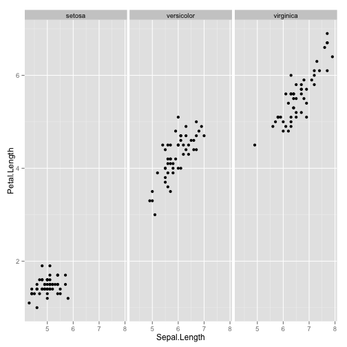

## Read-And-Delete

1. Edit YAML front matter
2. Write using R Markdown
3. Use an empty line followed by three dashes to separate slides!

--- .class #id 

## Slide 2

```
Make a grid scatterplot using ggplot2 showing relationship among variables, choosing two at a time
and displaying a third in the facet
```

 


